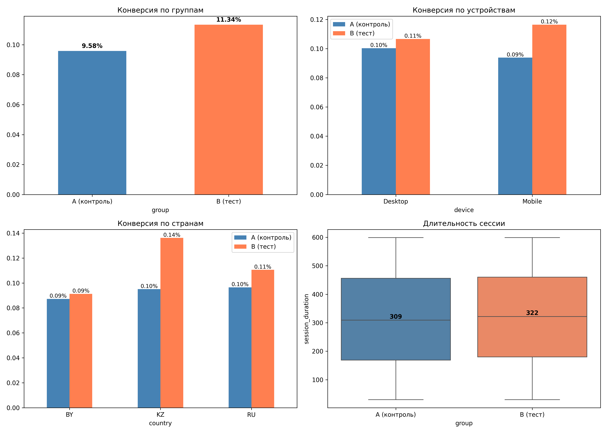

# ab-test-project
# A/B-тест: влияние кнопки на конверсию

## Задача
Проверить, увеличит ли новая версия кнопки «Купить» конверсию в покупку.

## Данные
10 000 пользователей, разделённых на две группы:
- **A (контроль)** — старая кнопка
- **B (тест)** — новая кнопка

Датасет сгенерирован с фиксированным seed для воспроизводимости.

## Метод
- **Z-тест для пропорций** — для конверсии
- **t-тест Стьюдента** — для сравнения
- **95% доверительные интервалы** — для оценки точности
- **Сегментный анализ** — по устройствам и странам
- **Guardrail-метрика** — длительность сессии

## Результаты

### Общие
| Метрика | Группа A | Группа B |
|---|---|---|
| Конверсия | 9.58% | 11.34% |
| Разница | — | +1.76% |
| Относительный рост | — | +18.37% |

### Z-тест и t-тест
| Метрика | Z-тест | t-тест |
|---|---|---|
| Статистика | 2.8755 | -2.8764 |
| p-value | 0.004034 | 0.004031 |
| CI нижняя | 0.0056 | 0.0056 |
| CI верхняя | 0.0296 | 0.0296 |

**Вывод:** оба теста показывают значимую разницу (p < 0.05).

### По устройствам
| Устройство | A | B | Разница | Значимо |
|---|---|---|---|---|
| Desktop | 10.03% | 10.67% | +0.63% | нет |
| Mobile | 9.38% | 11.64% | +2.26% | да |

**Вывод:** эффект в основном на мобильных устройствах.

### По странам
| Страна | A | B | Разница | Значимо |
|---|---|---|---|---|
| RU | 9.65% | 11.06% | +1.40% | да |
| KZ | 9.50% | 13.61% | +4.11% | да |
| BY | 8.73% | 9.13% | +0.41% | нет |

**Вывод:** эффект значим в RU и KZ.

### Guardrail: длительность сессии
| Группа | Длительность |
|---|---|
| A | 312.6 сек |
| B | 319.5 сек |
| Разница | +6.86 сек |

p-value = 0.0366. Формально значимо, но изменение маленькое —
всего +2,2%. Скорее нейтрально.

## Вывод
- Эффект положительный, но неоднородный.
- **Основной драйвер — mobile.**
**Рекомендация:** включить новую кнопку для всех, но последить
за десктопом — возможно, для него нужен отдельный дизайн.

## Визуализация

## Стек
Python (pandas, numpy, scipy, matplotlib, seaborn)

## Как запустить
1. `pip install -r requirements.txt`
2. `python generate_data.py`
3. `python 01_basic_analysis.py`
4. `python 02_segment_analysis.py`
5. `python 03_visualization.py`

## Файлы
- `generate_data.py` — генерация датасета
- `01_basic_analysis.py` — Z-тест, t-тест, CI
- `02_segment_analysis.py` — сегменты + guardrail
- `03_visualization.py` — графики
- `ab_test.csv` — датасет
- `ab_test_result.png` — дашборд
